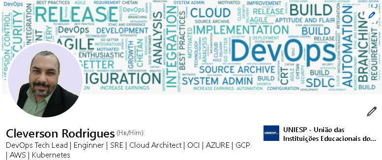

# Quem sou eu?

Olá, meu nome é Cleverson Rodrigues. Sou um profissional de tecnologia desde 2002, atualmente no segmento de cultura DevOps, com experiência em migrações de datacenters fisicos para cloud, automatização de processos e implementação de soluções multicloud.

Meu objetivo é simplificar e otimizar processos através de automação e integração de ferramentas DevOps, sempre buscando melhorias contínuas e garantindo segurança, resiliencia e conformidade dos sistemas.

Minha ultima alocação foi em parceria com a empresa inventCloud, onde fui responsável por manter e aprimorar o ambiente DevOps dos clientes, facilitando migrações e implementações multicloud.
Antes disso, trabalhei no Citi Brasil e CSU Card System como profissional de data center tier 3, gerenciando ambientes críticos, soluções de armazenamento e provendo automações de processos.

Tenho habilidades em ferramentas como Kubernetes, Terraform, Ansible, Jenkins, e sou certificado como Arquiteto pela Google e Oracle Cloud, entre outras certificações relevantes descritas no meu linkedin.

Estou sempre em busca de novos desafios e oportunidades de crescimento. Vamos nos conectar no LinkedIn ou GitHub para discutirmos como posso contribuir para o seu próximo projeto.

**linkedin:**
https://www.linkedin.com/in/cleversonbrsp/
