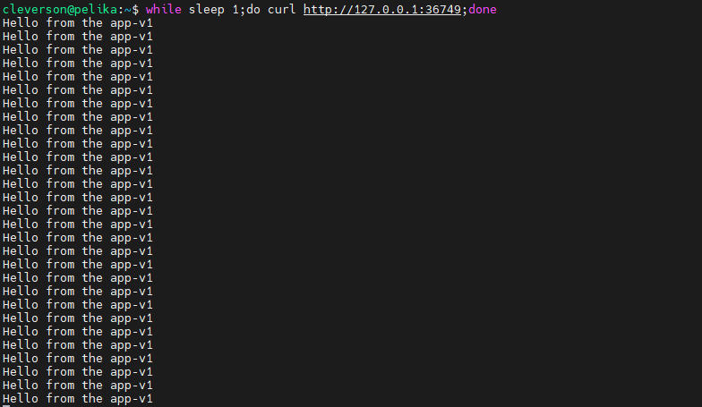
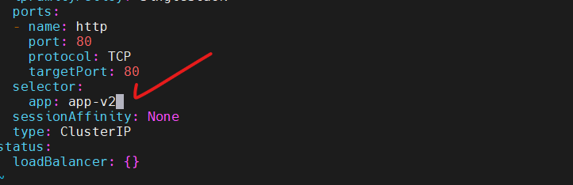
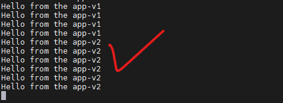

- - Gere 2 deployments app-v1 e app-v2 como nesse template:
  ```yaml
  apiVersion: apps/v1
  kind: Deployment
  metadata:
    labels:
      app: app-v1
    name: app-v1
  spec:
    replicas: 1
    selector:
      matchLabels:
        app: app-v1
    template:
      metadata:
        labels:
          app: app-v1
      spec:
        volumes:
          - name: shared-data
            emptyDir: {}
        initContainers:
          - name: init-myservice
            image: busybox
            command: ["/bin/sh"]
            args: ["-c", "echo Hello from the app-v1 > /pod-data/index.html"]
            volumeMounts:
              - name: shared-data
                mountPath: /pod-data
        containers:
          - name: nginx
            image: nginx
            ports:
              - containerPort: 80
            volumeMounts:
              - name: shared-data
                mountPath: /usr/share/nginx/html
  ```
  - Crie um service ‘clusterip’ (k create service clusterip app-blue-canary --tcp=80:80 $do > svc-app-blue-canary.yaml):
  ```yaml
  apiVersion: v1
  kind: Service
  metadata:
    creationTimestamp: null
    labels:
      app: app-blue-canary
    name: app-blue-canary
  spec:
    ports:
      - name: http
        port: 80
        protocol: TCP
        targetPort: 80
    selector:
      app: app-v1
    type: ClusterIP
  status:
    loadBalancer: {}
  ```
  - Aplique tudo.
  - No minikube precisamos tunnelar o trafego para conseguirmos executar um curl então no service, faça:
  ```yaml
  minikube service app-blue-canary
  ```
  - exemplo de output:
  ```yaml
  cleverson@pelika:~$ minikube service app-blue-canary
  |-----------|-----------------|-------------|--------------|
  | NAMESPACE |      NAME       | TARGET PORT |     URL      |
  |-----------|-----------------|-------------|--------------|
  | default   | app-blue-canary |             | No node port |
  |-----------|-----------------|-------------|--------------|
  😿  service default/app-blue-canary has no node port
  ❗  Services [default/app-blue-canary] have type "ClusterIP" not meant to be exposed, however for local development minikube allows you to access this !
  🏃  Starting tunnel for service app-blue-canary.
  |-----------|-----------------|-------------|------------------------|
  | NAMESPACE |      NAME       | TARGET PORT |          URL           |
  |-----------|-----------------|-------------|------------------------|
  | default   | app-blue-canary |             | http://127.0.0.1:36749 |
  |-----------|-----------------|-------------|------------------------|
  🎉  Opening service default/app-blue-canary in default browser...
  👉  http://127.0.0.1:36749
  ❗  Because you are using a Docker driver on linux, the terminal needs to be open to run it.
  ```
  - Para consultar a rota de trafego, podemos usar um ‘while’ para observar:
  ```bash
  while sleep 1;do curl http://127.0.0.1:36749;done
  ```
  - Output esperado:
    
  - Para direcionar o trafego para o app-v2, edite o selector do service:
    
  - Após salvar, perceba o trafego direcionado para o app-v2:
    
