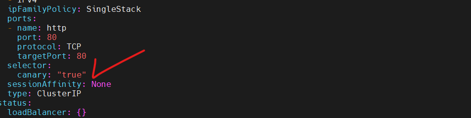

# LABORATÓRIO 2 (minikube)

- Usando o template anterior, adicione uma nova label nos dois manifestos (app-v1 e app-v2) para uso compartilhado. Nesse caso eu optei por ‘canary: ‘true’’ mas pode ser qualquer outra que faça sentido pra você:

```yaml
apiVersion: apps/v1
kind: Deployment
metadata:
  labels:
    app: app-v1
    canary: "true"
  name: app-v1
spec:
  replicas: 1
  selector:
    matchLabels:
      app: app-v1
      canary: "true"
  template:
    metadata:
      labels:
        app: app-v1
        canary: "true"
    spec:
      volumes:
        - name: shared-data
          emptyDir: {}
      initContainers:
        - name: init-myservice
          image: busybox
          command: ["/bin/sh"]
          args: ["-c", "echo Hello from the app-v1 > /pod-data/index.html"]
          volumeMounts:
            - name: shared-data
              mountPath: /pod-data
      containers:
        - name: nginx
          image: nginx
          ports:
            - containerPort: 80
          volumeMounts:
            - name: shared-data
              mountPath: /usr/share/nginx/html
```

- Crie um scale com por exemplo, 4 replicas:

```yaml
k scale deploy app-v1 --replicas=4
```

- Perceba que agora temos 4 pods do app-v1 e uma do app-v2. Considerando que cada pod do app-v1 representa 25%, temos a some de 100%:

  

- Vamos editar o service com a label compartilhada:

  

- Nessa estratégia, o controle fica no setup de replicas da aplicação, ou seja, pela sua quantidade. Dando certo o patch, vamos ajustando a quantidade de réplicas:

  

- Esse entendimento é necessário para prova CKAD mas no dia a dia essa estratégia dificilmente é aplicada dessa forma pois são utilizadas outras ferramentas para esta finalidade, como foi dito em ‘Vantagens e Desvantagens’.
